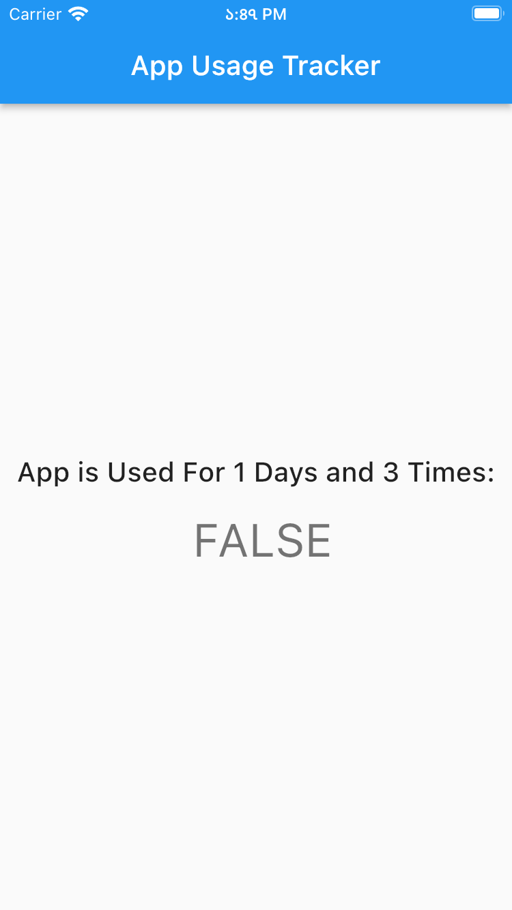

# example

A Flutter Application to check "AppUsageTracker" Package

## Screenshots

|             App Usages Tracker (FALSE)              |              App Usages Tracker (TRUE)              |
|:---------------------------------------------------:|:---------------------------------------------------:|
|  |  |

### APP USAGE TRACKER: [PUB.DEV](https://pub.dev/packages/app_usage_tracker)

### APP USAGE TRACKER: [GITHUB](https://github.com/alamin-karno/app_usage_tracker)